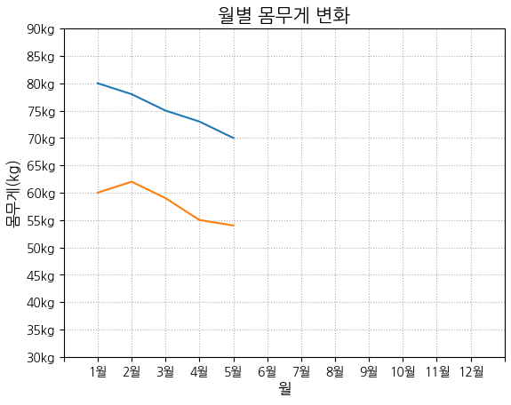

# 파이썬 matplotlib(1)

23.05.15

### 기본 그래프 그리기

```python
import matplotlib.pyplot as plt

plt.plot(data)
```

- y축 데이터로 그리기
    
    1차원 list, tuple, Series 데이터를 전달하여 그래프를 그린다.
    x축은 데이터의 인덱스로 자동 지정된다.
    
    ```python
    data = [1,5,3,9,7]
    plt.plot(data)
    ```
    
- x축, y축 데이터로 그리기
    
    x축과 y축 데이터의 길이가 같아야한다.
    
    ```python
    x = [1,5,6,9,10]
    y = [1,5,3,9,7]
    
    plt.plot(x,y)
    ```
    

### 한글 폰트 사용

```python
# 폰트 확인하기
import matplotlib.font_manager as fm
[f.name for f in fm.fontManager.ttflist if 'Malgun' in f.name]

# 한글폰트 지정
plt.rcParams['font.family'] = 'Malgun Gothic'

# 한글폰트 사용 시 -기호 깨지는 문제 해결
plt.rcParams['axes.unicode_minus']=False
```

### 색상, 마커, 선

1. **색상**
    
    color = 색상 이름
    자주 사용하는 색상은 약자를 사용할 수 있다.
    (blue:b, green:g, red:r, cyan:c, magenta:m, yellow:y, black:k, white:w)
    hex code로도 사용이 가능하다.
    
    ```python
    plt.plot(data, color='skyblue')
    plt.plot(data, color='r')
    plt.plot(data, color='#A566FF')
    ```
    

1. **마커**
    
    marker : 마커 종류 (. , o v ^ < > 1 2 3 4 s p * h H + x D d)
    markersize, ms : 마커 사이즈
    markeredgecolor, mec : 마커 선 색상
    markeredgewidth, mew : 마커 선 굵기
    markerfacecolor, mfc : 마커 내부 색상
    
    ```python
    plt.plot(x, y, color='#A566FF', marker='D', ms='10', mec='b', mew='3', mfc='y')
    ```
    

1. **선**
    
    linestyle, ls : 선 스타일
    linewidth, lw : 선 굵기
    
    ```python
    # 선 스타일 종류
    # '-' : solid line style
    # '--' : dashed line style
    # '-.' : dash-dot line style
    # ':' : dotted line style
    
    plt.plot(x, y, color='#A566FF', ls=':', lw=3)
    ```
    

- **[색상][마커][선] 순서로 한번에 표기가 가능하다.**
    
    ```python
    # 색상, 마커 : 빨간 점
    plt.plot(x, y, 'ro')
    
    # 색상, 선 : 노란 파선
    plt.plot(x, y, 'y--')
    
    # 마커, 선 : 별 마커, 점선
    plt.plot(x, y, '*:')
    
    # 색상, 마커, 선 : 초록 점선, 별 마커
    plt.plot(x, y, 'g*:')
    ```
    

### 그래프 제목, 축 레이블, 그리드

- 제목
    
    ```python
    plt.title('제목')
    loc : 제목 위치 (left/right/center)
    pad : 타이틀과 그래프와의 간격
    color : 폰트 색상
    fontsize : 폰트 크기
    fontweight : 폰트 굵기 (normal, bold, heavy, light, ultrabold, ultralight)
    fontfamily : 폰트 종류
    ```
    
- 축 레이블
    
    ```python
    plt.xlabel('레이블')
    plt.ylabel('레이블')
    loc : 위치 (left, center, right / bottom, center, top)
    labelpad : 레이블과 그래프와의 간격
    color : 폰트 색상
    fontsize : 폰트 크기
    fontfamily : 폰트 종류
    ```
    
- 그리드
    
    ```python
    plt.grid(True)
    axis : 그리드 방향 ('x':x축, 'y':y축)
    ls, lw, color, alpha 등의 속성 지정 가능
    ```
    

### 축 범위 및 눈금 설정

- **축 범위 설정**
    
    ```python
    plt.xlim(x_min, x_max)
    plt.ylim(y_min, y_max)
    ```
    

- **눈금 (tick) 설정**
    
    ```python
    # tick 지정
    plt.xticks(x_tick_list)
    plt.yticks(y_tick_list)
    
    # tick 레이블 지정
    plt.xticks(x_tick_list, x_tick_label_list)
    plt.yticks(y_tick_list, y_tick_label_list)
    
    # tick 스타일 지정
    plt.tick_params()
    direction : tick 위치 (in, out, inout)
    length : tick의 길이
    width : tick의 두께
    color : tick 색상
    labelcolor : tick label 색상
    colors : tick과 tick label 색상
    pad : tick과 tick label 사이의 거리
    labelsize : tick label 사이즈
    axis : 축 지정
    ```
    

### 그래프 여러개 그리기 및 범례 설정

- **그래프 여러개 그리기**
    
    ```python
    df1 = pd.DataFrame({'월':[1,2,3,4,5],'몸무게':[80,78,75,73,70]})
    df2 = pd.DataFrame({'월':[1,2,3,4,5],'몸무게':[60,62,59,55,54]})
    
    # 두 그래프 그리기
    plt.plot(df1['월'],df1['몸무게'])
    plt.plot(df2['월'],df2['몸무게'])
    
    # 그래프 제목
    plt.title('월별 몸무게 변화', size=15)
    
    # 축 라벨
    plt.xlabel('월', fontsize=12)
    plt.ylabel('몸무게(kg)', fontsize=12)
    
    # x축 틱 : 1월, 2월, 3월,...,12월
    plt.xticks(range(0,14,1), labels=xtick_label)
    
    # y축 틱 : 30kg, 35kg, 40kg, ..., 90kg
    plt.yticks(range(30,95,5), labels=ytick_label)
    
    # 그리드
    plt.grid(ls=':')
    
    #마지막에 한번만 사용하면 여러 개의 그래프를 한번에 그릴 수 있다.
    plt.show()
    ```
    
    
    

- **범례 표시하기**
    
    그래프에 레이블을 지정 후 (label = 그래프명) 범례를 표시한다. (plt.legend())
    범례의 위치는 그래프에 따라 최적의 위치에 자동으로 생성된다.
    
    ```python
    plt.legend()
    ```
    
    ```python
    # 범례 위치 지정 (1)
    plt.legend(loc=위치번호)
    
    # 범례 위치 지정 (2)
    # 0: best, 1: upper right, 2: upper left, 3: lower left, 
    # 4: lower right, 5: right, 6: center left, 7: center right,
    # 8: lower center, 9: upper center, 10: center
    plt.legend(loc=위치이름)
    
    # 범례 위치 지정 (3)
    # 범례의 왼쪽 하단이 기준점이다.
    plt.legend(loc=(x좌표, y좌표))
    ```
    
    ```python
    범례 속성 지정
    
    - 열 개수 : plt.legend(ncol=열 개수) 
    - 폰트 크기 : plt.legend(fontsize=폰트 크기)
    - 테두리 : plt.legend(frameon=True/False)
    - 음영 : plt.legend(shadow=True/False)
    - 바탕색 : plt.legend(facecolor=색상)
    - 테두리색 : plt.legend(edgecolor=색상)
    ```
    

### Subplot 그리기

```python
# 1. 전체 그래프의 크기를 정한다.
plt.figure(figsize=(x_size, y_size))

# 2. 그래프를 그려 넣을 격자를 지정한다.
plt.subplot(전체 행 개수, 전체 열 개수, 그래프 순서)

# 3. 격자에 그래프를 하나씩 추가한다.
plt.plot(df1['x'], df1['y'])
plt.plot(df2['x'], df2['y'])
```

- Subplot의 속성 지정
    
    ```python
    # figure 객체를 변수로 지정.
    fig = plt.figure()
    
    # suptitle(제목) 메서드로 전체 그래프의 제목을 표시
    fig.suptitle('title')
    
    # tight_layout() 메서드로 그래프의 간격, 너비를 최적화
    fig.tight_layout()
    ```
    

### 그래프의 위치, 크기 설정

- figure : 그래프가 그려지는 캔버스
- axes : 하나의 그래프

```python
# figure 객체 생성
fig = plt.figure(figsize=(가로길이, 세로길이))

# figure 객체의 add_axes 메서드로 위치와 크기를 설정하여 axes 객체 생성
ax1 = fig.add_axes([left, bottom, width, height])

# axes에 그래프를 그린다.
ax1.plot(x, y)

# axes에 제목 추가
ax1.set_title('title')
```

### Subplot 그리기 (2)

- **axes 쪼개기**
    
    ```python
    # plt.subplots() 함수를 호출하면 figure, axes 객체를 생성하여 튜플 형태로 반환한다.
    fig, ax = plt.subplots()
    
    # axes 객체를 행/열로 쪼개어 생성
    fig, ax = plt.subplots(nrows=행 개수, ncols=열 개수, figsize(가로사이즈, 세로사이즈))
    
    # axes[행번호][열번호] 형태로 접근하여 그래프 그리기
    
    # Subplot간에 축을 공유할 수 있다.
    sharex=True, sharey=True
    ```
    
    ```python
    import seaborn as sns
    anscombe = sns.load_dataset('anscombe')
    df1 = anscombe[anscombe['dataset']=='I']
    df2 = anscombe[anscombe['dataset']=='II']
    df3 = anscombe[anscombe['dataset']=='III']
    df4 = anscombe[anscombe['dataset']=='IV']
    
    # 1) axes 객체를 행/열로 쪼개어 생성
    # 3) Subplot간에 축을 공유할 수 있다.
    fig,ax = plt.subplots(nrows=2, ncols=2, figsize=(8,6), sharex=True, sharey=True)
    
    # 2) axes[행번호][열번호] 형태로 접근하여 그래프 그리기
    ax[0][0].plot(df1['x'],df1['y'],'o')
    ax[0][1].plot(df2['x'],df2['y'],'^')
    ax[1][0].plot(df3['x'],df3['y'],'*')
    ax[1][1].plot(df4['x'],df4['y'],'d')
    
    # 4) 각 그래프에 제목 추가
    ax[0][0].set_title('ax1')
    ax[0][1].set_title('ax2')
    ax[1][0].set_title('ax3')
    ax[1][1].set_title('ax4')
    
    # 4) 각 그래프에 그리드 추가
    ax[0][0].grid(ls=':')
    ax[0][1].grid(ls=':', color='pink')
    ax[1][0].grid(ls=':', color='skyblue')
    ax[1][1].grid(ls=':', color='green', alpha=0.5)
    
    # 6) 그래프 전체 제목
    fig.suptitle('Anscombe', size=20)
    
    # 7) 그래프 간격, 크기 최적화
    fig.tight_layout()
    ```
    
    
    

- **그래프 순서에 따라 Subplot 그리기**
    
    ```python
    # figure 객체 생성
    fig = plt.figure()
    
    # Subplot을 그릴 axes 객체 생성
    ax = fig.add_subplot(전체 행 개수, 전체 열 개수, 순서)
    
    # axes 객체에 그래프 그리기
    ax.plot(x, y)
    
    # 축 공유하기 : 어떤 axes의 축을 공유할 것인지 지정
    sharex=axes객체, sharey=axes객체
    ```
    
    ```python
    import seaborn as sns
    anscombe = sns.load_dataset('anscombe')
    df1 = anscombe[anscombe['dataset']=='I']
    df2 = anscombe[anscombe['dataset']=='II']
    df3 = anscombe[anscombe['dataset']=='III']
    df4 = anscombe[anscombe['dataset']=='IV']
    
    # 1) figure 객체를 생성
    fig = plt.figure(figsize=(9,6), facecolor='ivory')
    
    # 2) Subplot을 그릴 axes 객체 생성
    ax1 = fig.add_subplot(2,2,1)
    ax2 = fig.add_subplot(2,2,2, sharex=ax1, sharey=ax1)
    ax3 = fig.add_subplot(2,2,3, sharex=ax1, sharey=ax1)
    ax4 = fig.add_subplot(2,2,4)
    
    # 3) axes 객체에 그래프 그리기
    # 4) 축 공유하기 : 어떤 axes의 축을 공유할 것인지 지정
    ax1.plot(df1['x'],df1['y'],'o', label='ax1')
    ax2.plot(df2['x'],df2['y'],'^', label='ax2')
    ax3.plot(df3['x'],df3['y'],'*', label='ax3')
    ax4.plot(df4['x'],df4['y'],'+', label='ax4')
    
    # 4) 틱 변경하기
    ax4.set_xticks(range(1,20,1))
    ax4.set_yticks(range(1,15,1))
    
    # 5) 범례 표시하기
    ax1.legend(loc=2)
    ax2.legend(loc=2)
    ax3.legend(loc=2)
    ax4.legend(loc=2)
    
    # 6) figure 제목 추가하기
    fig.suptitle('Anscombe', size=20)
    
    # 8) 그래프 크기,간격 최적화하기
    fig.tight_layout()
    
    plt.show()
    ```
    
    
    

- 이미지 파일로 저장하기
    
    ```python
    fig.savefig('파일명', dpi=해상도) # 해상도 default : 100
    ```
